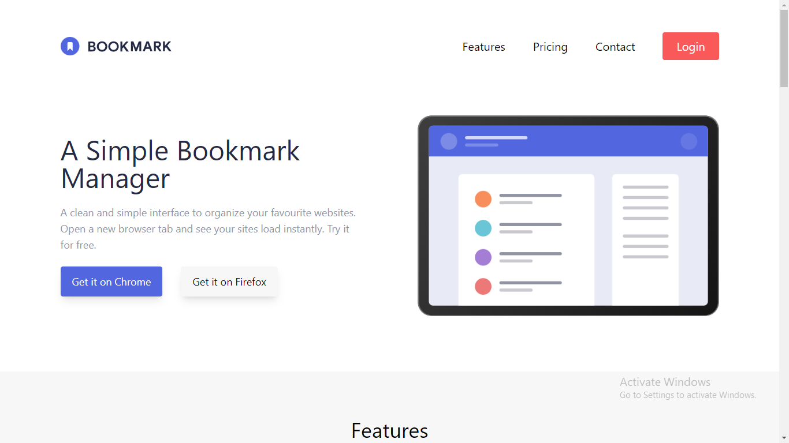

# Bookmark Landing Page

## Description

This project is a landing page for a browser extension "Bookmark". It is created using `HTML` and `Tailwind CSS` and is responsive for both mobile and tablet screens.

## Components of a website

This website is divided into follwing sections :-

- Navigation bar
- Hero section
- Features section
- Download extensions section
- FAQ section
- Sign up section
- Footer

### Preview of the project :-

### [Live link](https://bookmark-landing-page-rxeu.vercel.app/) of the project
